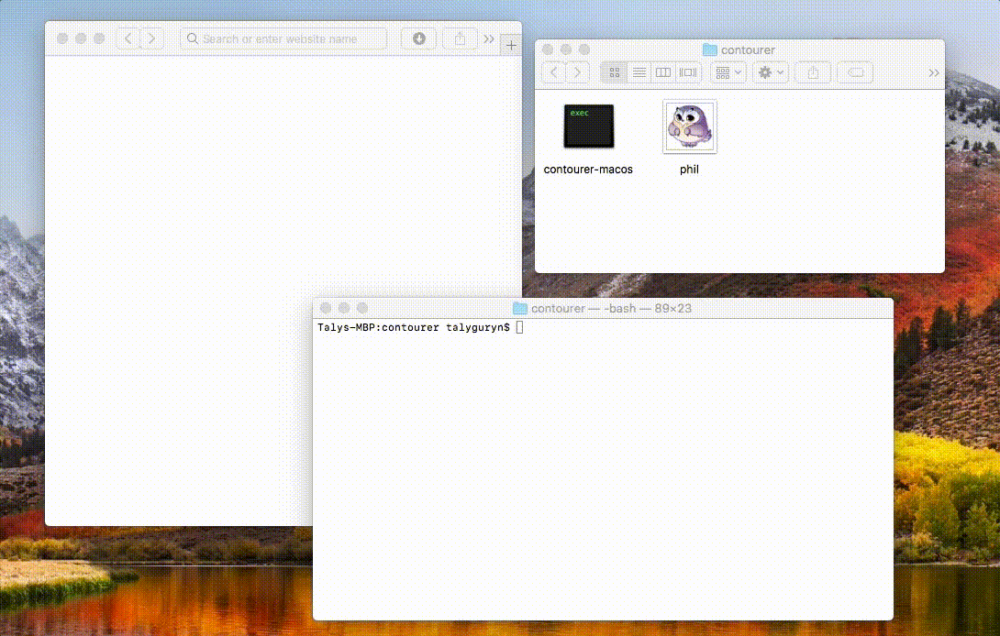

# Contourer

Tool for creating svg contours for images.



## Example

As an original image you should use png pic with a transparent background.

| **Original image**            | **color: `red`<br>margin: `0`**       | **color: `blue`<br>margin: `10`**       |
|-------------------------------|---------------------------------|----------------------------------|
|  |  |  |

[How it works](docs/how-it-works.md)

## Usage

Download version for your OS from releases.

Run app with path to image as an argument.

```sh
./contourer-linux path/to/image.png
```

Vectorized copy of image with contour will be created near the source file. It will have the same name and `.svg` extension.

### Customization

Set up contour color with `color` (default: `pink`) arg.

```sh
./contourer-linux path/to/image.png --color=blue
```

You can set `margin` (default: `0`).

```sh
./contourer-linux path/to/image.png --margin=10
```

## Improvements

Fork me and feel free to ask questions, report bugs and open pull requests. Check out [developer's guide](docs/development.md).

## License

GPL-2.0
