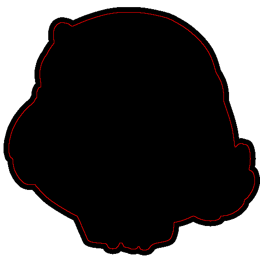
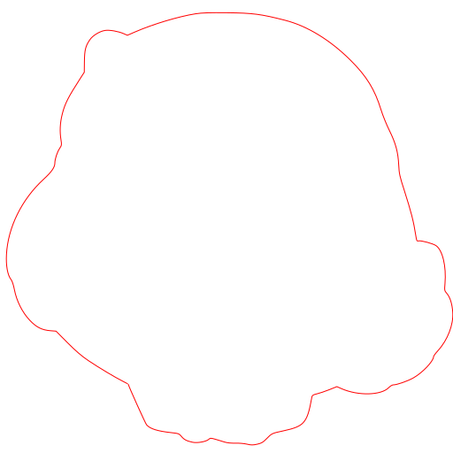

# How it works

Step by step explanation of Contourer's work.

## Get a source image                       

## Create a shade

Paint black each non transparent pixel                

## Find a contour

For each black pixel we check his 8 adjacent pixels. If one of them is transparent then target pixel is on the contour of image.

## Extend the shade

Each contour's pixel should be «enlarged» to the margin size. We do this to create contour that places with a distance to image.

## Color it black

Actually we don't draw this red contour. This step is for better understanding the process.

## Trace a shade

Now we have a shade that should be traced. At the end of this step Potrace will return a vectorized copy of this shape. We use modified version of [node-potrace](https://github.com/stickerum/node-potrace) so we able to set up color for shape's stroke.

## Remove filling                  

Returned vectorized shape doesn't have any filling. It also was done for understanding.

## Сombine with an original image

The last step is combine svg contour and image to one file. To do this we encode source image to base64 and add it to svg code.

